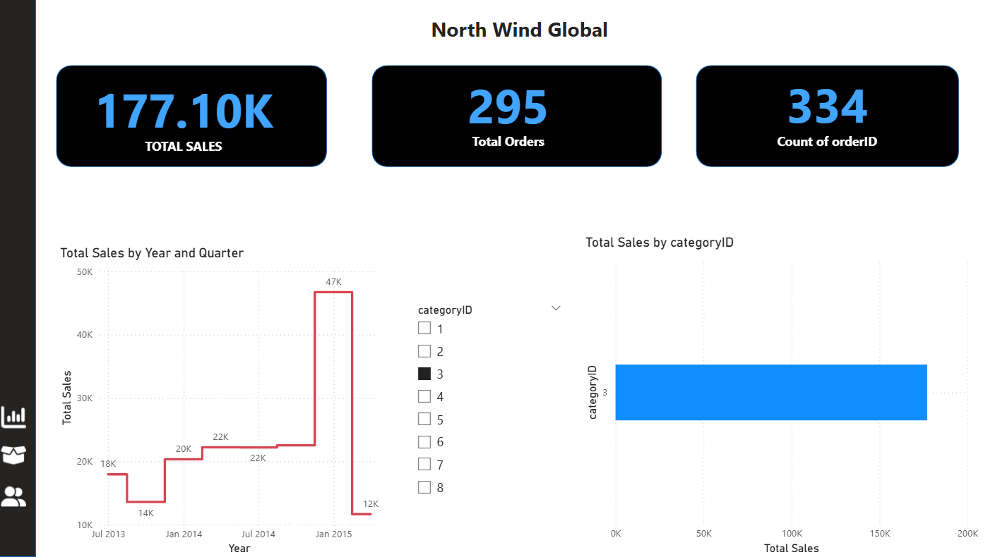

Northwind Global Sales & Operations Analysis
* Overview

This project analyzes global sales performance using the Northwind dataset. The goal was to evaluate operational efficiency, revenue trends, product performance, and regional distribution to support strategic business decisions.

* Business Objective

Businesses require visibility into revenue drivers and operational bottlenecks. This dashboard answers:

Which products drive the most revenue?

Which regions are underperforming?

What are the monthly and seasonal sales trends?

Who are the highest-value customers?

How does order volume impact revenue growth?

*Tools & Technologies

Power BI

Excel (Data Preparation)

Data Modeling (Star Schema)

DAX Measures

KPI Development

* Key Performance Indicators

Total Revenue

Revenue by Region

Top 10 Products

Sales by Category

Monthly Revenue Trends

Customer Revenue Contribution

*Key Insights

Identified revenue concentration in top-performing product categories.

Highlighted underperforming regions with expansion opportunities.

Revealed seasonal sales spikes impacting revenue distribution.

Determined top customer segments driving profitability.

* Skills Demonstrated

Data Cleaning & Preparation

Relational Data Modeling

KPI Development using DAX

Business Intelligence Reporting

Operational Performance Analysis

Data Storytelling

Professional Relevance

This project demonstrates practical application of business intelligence techniques used in operations, healthcare analytics, supply chain management, and logistics performance monitoring.

##  Dashboard Preview

### 1️⃣ Sales Overview

---

### 2️⃣ Employee Performance

---

### 3️⃣ Product & Customer Insights

